# Deploying a Node.js Application on AWS EC2
## Introduction
This project demonstrates how to deploy a **Node.js application** on an **AWS EC2 instance**. Node.js is a lightweight and efficient runtime for building scalable web applications, and AWS EC2 provides a flexible cloud environment to host them. The deployment process includes launching an EC2 instance, installing Node.js and npm, setting up the application files, running the app, and using **PM2** for process management to keep the application running continuously. This setup ensures that the Node.js application is accessible from the browser and remains available even after server restarts.  

## Prerequisites 
Before starting, make sure you have:  
- An **AWS account** with permission to launch EC2 instances  
- A **key pair (.pem file)** to connect to your instance  
- Security Group configured to allow:  
  - **Port 22 (SSH)** → to connect to the server  
  - **Port 3000 (or your app’s port)** → to access the Node.js application  
- Installed tools on your local machine:  
  - **SSH client** (Git Bash)

## Steps to Deploy 
### Step 1: Launch EC2 instance and Establishing a secure connection to your EC2 instance
1. Launch instance 
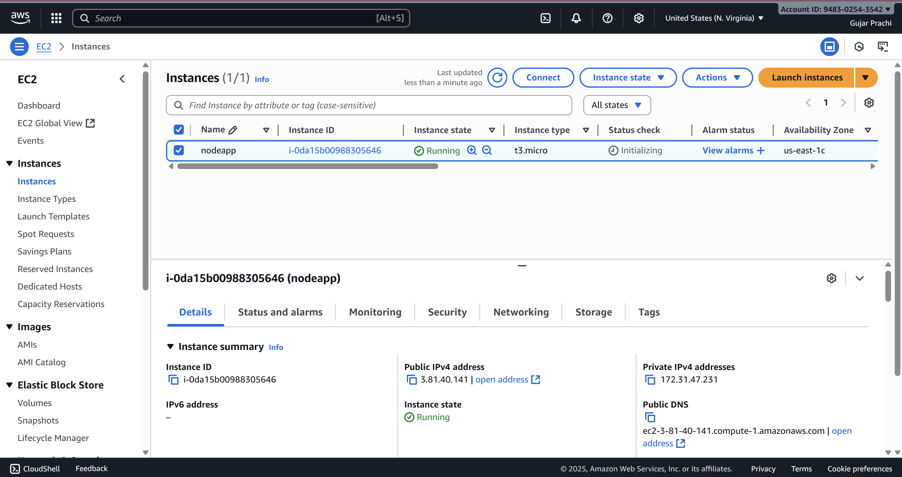
2. Copy the SSH connection command from the EC2 instance.
- Open Git Bash and paste the copied SSH command to connect to the instance.
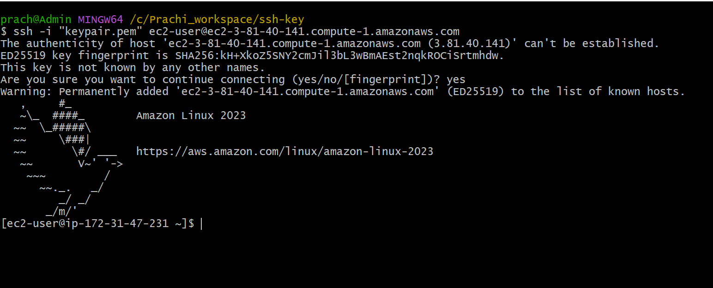
### Step 2: Update Packages and Install Node.js
1. Update Package and Install Node
    ```bash
    # update
    sudo yum update
    # install node.js
    sudo yum install nodejs -y
    ```
    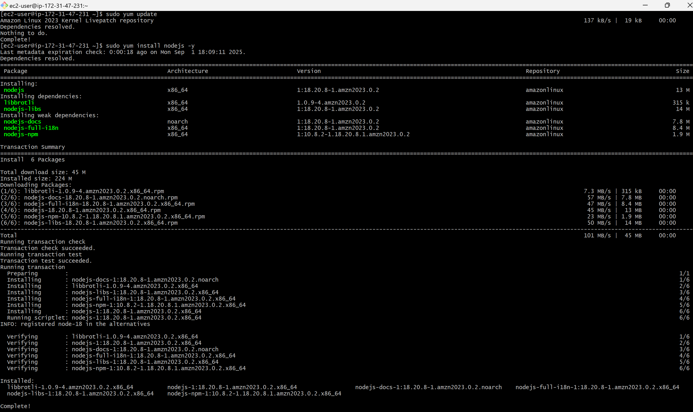
2. Install npm
    ```bash
    sudo yum install npm -y
    ```
    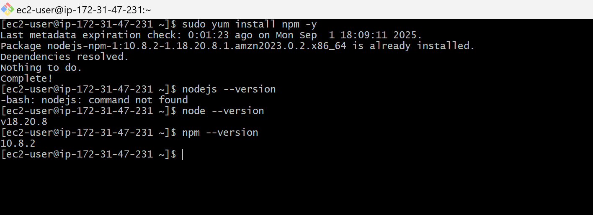

### Step 3: Upload/Clone Your Application
1. Install Git
    ``` bash
    sudo yum install git
    ```
    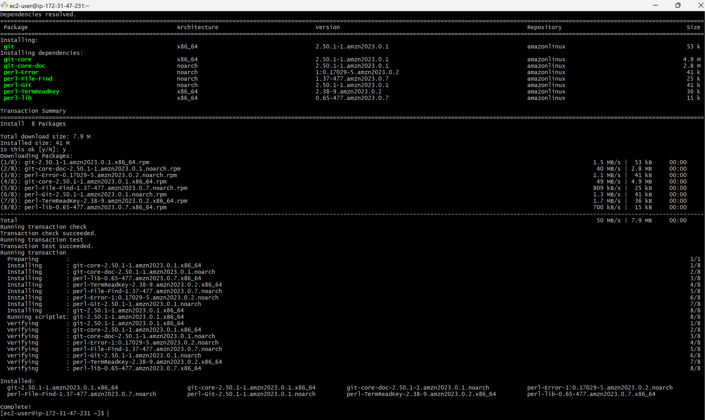

2. Clone the Application
    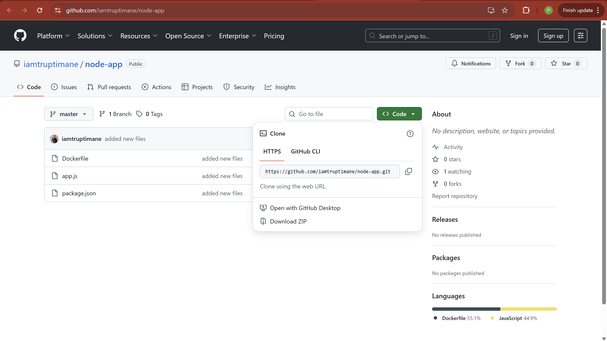
    ``` bash
    git clone <git url>
    ```
    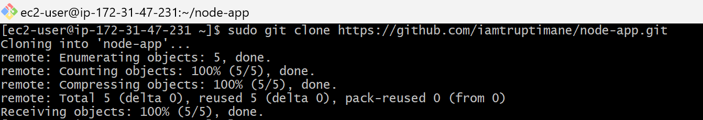

3. Go inside the project folder (node-app)
    ``` bash
    cd node-app
    ```
    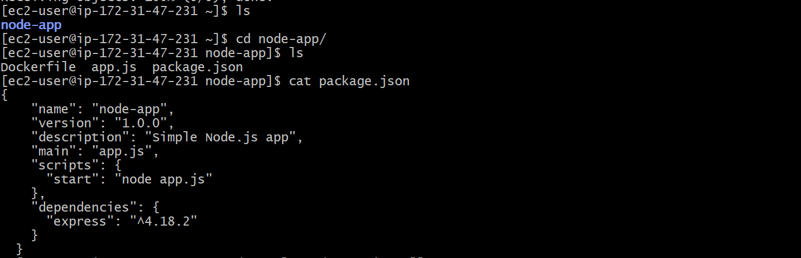

### Step 4: Install Dependencies
``` bash
    # install npm
    sudo npm install
    # run the application
    sudo npm start app.js
```
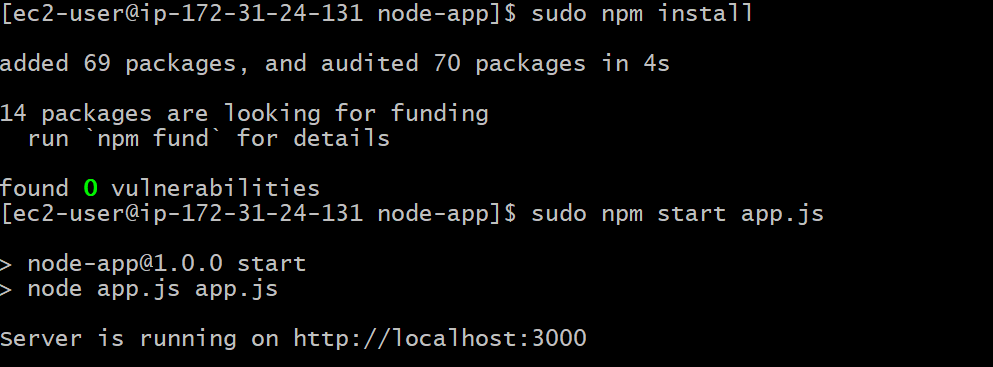

### Step 5: Keep the App Running (PM2)
``` bash
# Install PM2 to run Node.js apps in the background
sudo npm install -g pm2
# Run the Application
sudo npm start app.js
```
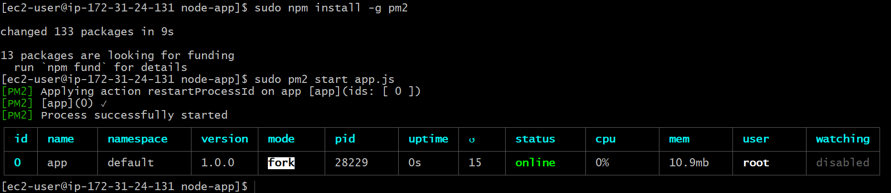

### Step 6: Deployed the nodejs application
Copy the Public Key and paste it along with port 3000 in any browser.
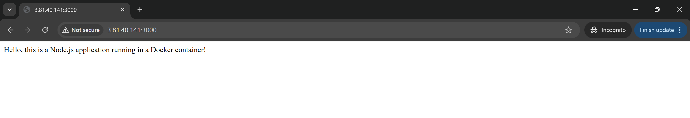


## Summary 
This project shows how to set up a Node.js runtime environment on AWS EC2, deploy an application, and manage it using PM2. With this setup, your Node.js app is accessible over the internet and remains available even after server restarts.
